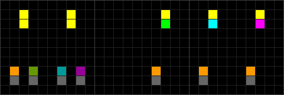
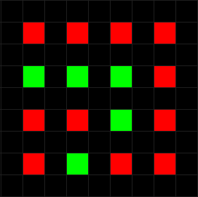
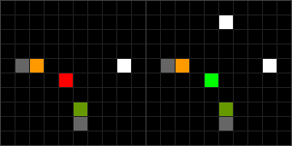
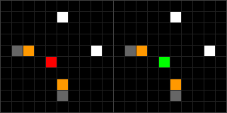
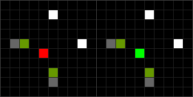
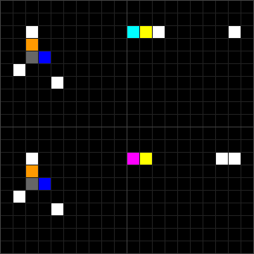
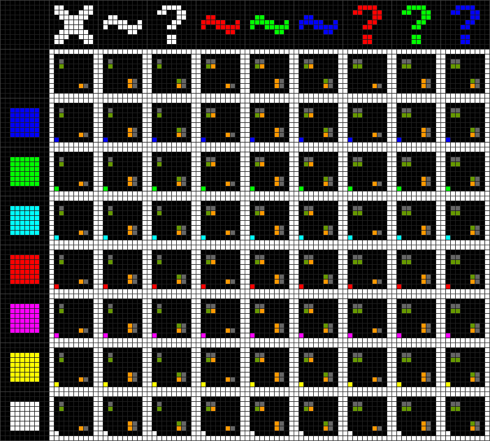

# Colorized

Colorized is a cellular automaton, similar to [Wireworld](https://github.com/GollyGang/ruletablerepository/wiki/WireWorld) or [JvN](http://golly.sourceforge.net/Help/Algorithms/JvN.html). Colorized is notably different from those examples because signals propogate through empty space instead of wires. This isn't a new idea; Colorized is heavily based on Joel Walker's 2011 "Particles" rule (found [here](https://github.com/GollyGang/ruletablerepository/wiki/TheRules#wireworld-and-derivatives)) and Redstoneboi's "Sticky" rule. Rather than aiming for a minimum of states or transitions, the primary goal of Colorized is to be easy to use for computation and construction, with simplicity and minimalism as lower priorities.

You can simulate Colorized using [Golly](http://golly.sourceforge.net/); copy and paste the contents of [`Colorized.rule`](https://raw.githubusercontent.com/HactarCE/Colorized-CA/master/Colorized.rule) into Golly to get started.

- [Mechanics](#mechanics)
    - [States](#states)
    - [Photons](#photons)
        - [Parity](#parity)
    - [Basic interactions](#basic-interactions)
        - [Photon-block](#photon-block)
        - [Photon-photon](#photon-photon)
    - [Photon conversion](#photon-conversion)
    - [Memory cell](#memory-cell)
        - [Memory cell read](#memory-cell-read)
        - [Memory cell reset](#memory-cell-reset)
        - [Memory cell toggle](#memory-cell-toggle)
    - [Pusher and puller photons](#pusher-and-puller-photons)
    - [Construction](#construction)
- [Examples](#examples)
    - [Signal manipulation](#signal-manipulation)
    - [Logic gates](#logic-gates)
- [Implementation](#implementation)
    - [Photon propogation](#photon-propogation)

## Mechanics

### States

Colorized currently has 15 states:


Colorized gets its name from the first eight states, which are the colors black (which doubles as a vacuum/blank state), blue, green, cyan, red, magenta, yellow, and white respectively. These eight states are sometimes referred to as "blocks." Any pattern consisting only of blocks is stable. You may notice that the binary representation of a block corresponds to the red, green, and blue components of its color; this is intentional.


The next five states are used for photons, which are patterns that move at [_c_](https://conwaylife.com/wiki/Speed) (1 cell per generation). The first of these (grey) is used as the "tail" of a photon, and any of the other four can be the "head" of a photon.


The last two are temporary states used for construction.


### Photons

Colorized has four types of photons:

| Image                                 | Head state | Description         |
|---------------------------------------|------------|---------------------|
|    | 9          | Signal photon       |
|    | 10         | Construction photon |
|     | 11         | Pusher photon       |
|  | 12         | Puller photon       |

(Each photon pictured is moving to the right.)

#### Parity

The parity of a photon (similar to a glider's "[color](https://www.conwaylife.com/wiki/Glider#Colour_of_a_glider)" in Conway's Game of Life, although that term would be confusing in this context) is either odd or even, and can be calculated by summing the X and Y positions of the photon along with the generation count. The parity (odd vs. even) of the resulting number gives the parity of the photon. A photon cannot change parity without interacting with a magenta block.

It doesn't really matter whether a given photon has odd or even parity, but it does matter whether two photons have _different_ parities. Two photons are considered "in phase" if they have the same parity, and "out of phase" if their parities differ.

### Basic interactions

#### Photon-block

_Copy and paste this RLE into Golly and refer to it while reading this section:_

```
x = 90, y = 10, rule = Colorized
3.G16.HI2.G15.HI2.A35.HI3.G$69.G14.E4.G$60.HI2.E4.G14.2G$69.G$HI2.C
15.HI7.G10.HI7.G30.HI7.G$24.G18.GA38.GE4.G$40.G19.HI7.G13.G.G$64.E4.G
$3.G60.2G$45.G38.G!
```

White is an **absorber**. A head-on collision with white will annihilate the photon.

Cyan is a **splitter**. A head-on collision with cyan will split a photon into two orthogonal ones of the same type.

Blue is a **rotator**. A head-on collision with blue will annihilate the photon, but if a photon slides past blue directly adjacent to it, a new photon of the same type will be produced orthogonal to the original one.

Magenta is a **diagonal duplicator**. In its immediate vicinity, magenta allows photon heads to spread both orthogonally (as normal) and diagonally.

Red, green, and yellow usually behave the same way as white, but it is recommended **not** to use them in pure logic devices due to their special behavior in construction and memory storage.

These interactions are primarily intended for signal photons (orange), but white and cyan generally work for construction photons (green) as well:

```
x = 30, y = 10, rule = Colorized
3.G16.HJ2.G4$HJ2.C15.HJ7.G$24.G3$3.G!
```

See [Examples - Signal manipulation](#signal-manipulation) for more examples.

#### Photon-photon

There are five ways that two photons can collide and interact. The first three are in-phase while the last two are out-of-phase:


```
x = 50, y = 12, rule = Colorized
4.G20.G8.2G8.2G5$.HI3.IH3.HI8.HI8.HI4.IH2.HI$25.I$25.H19.I$15.I29.H$
15.H2$4.G19.G9.2G!
```

In the second collision shown above, a cyan or blue block can cause one or both of the photons to survive:


```
x = 28, y = 8, rule = Colorized
24.G$5.C18.A$HI8.HI8.HI$16.AG8.AG3$5.I9.I9.I$5.H9.H9.H!
```

Three of these collisions work with construction photons (green) as well. (The other two interfere with transitions used for [construction](#construction).)


```
x = 50, y = 12, rule = Colorized
4.G29.2G8.2G5$.HJ3.JH23.HJ4.JH2.HJ2$45.J$45.H3$4.G29.2G!
```

For collisions where a "double photon" or "fat photon" emerges, a signal photon and construction photon can be used together to create a single mixed photon. This is invaluable for [construction](#construction).


```
x = 30, y = 12, rule = Colorized
4.2G8.2G8.2G5$.HI4.JH2.HI8.HJ2$15.J9.I$15.H9.H3$4.2G!
```

See [Examples - Logic gates](#logic-gates) for examples of how these collisions can be used in conjunction with photon-block interactions to make logic gates.

### Photon conversion

In conjunction with another block, yellow blocks can be used to construct **photon converters** which convert one type of photon into another.



```
x = 30, y = 10, rule = Colorized
$2.F4.F9.F4.F4.F$2.F4.F9.B4.C4.E5$.I.J2.K.L7.I4.I4.I$.H.H2.H.H7.H4.H
4.H!
```

### Memory cell

Although a simple memory cell could be constructed out of logic gates, Colorized provides a very compact built-in option. A single red or green block (state 4 or 2 respectively) is a memory cell; red = off/`0`, green = on/`1`. Memcells can be arranged in a grid with a density of 25%, like so:



There are three operations: read, reset, and toggle.

#### Memory cell read

Colliding a construction photon and a signal photon near a memory cell will destroy the construction photon if the memory cell is off, or convert it into a signal photon if the memory cell is on:



```
x = 20, y = 10, rule = Colorized
$15.G3$.HI5.G2.HI5.G$4.D9.B2$5.J9.J$5.H9.H!
```

Note that the original signal photon is preserved; this enables reading a whole row of memcells at once:

```
x = 20, y = 20, rule = Colorized
$6.G2$3.C3.AG.D.D.D.D$2.G15.G$7.AG.B.B.D.B2$7.AG.D.D.D.D2$7.AG.D.D.D.
D$3.I$3.H6.G.G.G.G$10.A.A.A.A$5.HJ11.G3$16.C$15.G!
```

#### Memory cell reset

Colliding two signal photons near a memory cell will set the memory cell's state to "off" (i.e. red):



```
x = 20, y = 10, rule = Colorized
$5.G9.G3$.HI5.G2.HI5.G$4.D9.B2$5.I9.I$5.H9.H!
```

Note that both photons are preserved; this enables resetting a whole array of memcells at once:

```
x = 20, y = 20, rule = Colorized
$6.G4.G.G.G.G$18.G$7.AG.D.B.B.B$18.G$7.AG.D.D.D.B$18.G$7.AG.B.D.B.D$
18.G$7.AG.D.B.D.D2$6.I3.G.G.G.G$6.H3.A.A.A.A$7.HI9.G!
```

#### Memory cell toggle

Colliding two signal photons near a memory cell will switch the memory cell's state:



```
x = 20, y = 10, rule = Colorized
$5.G9.G3$.HI5.G2.HI5.G$4.D9.B2$5.I9.I$5.H9.H!
```

Note that both photons are preserved; this enables toggling a whole array of memcells at once:

```
x = 20, y = 20, rule = Colorized
$6.G4.G.G.G.G$18.G$7.AG.D.B.B.B$18.G$7.AG.D.D.D.B$18.G$7.AG.B.D.B.D$
18.G$7.AG.D.B.D.D2$6.J3.G.G.G.G$6.H3.A.A.A.A$7.HJ9.G!
```

### Pusher and puller photons

Pusher photons (teal) push blocks, while puller photons (purple) pull blocks:



```
x = 20, y = 20, rule = Colorized
2$2.G7.CFG2.F2.G$2.I$2.HA$.G$4.G6$2.G7.EF2.F2.2G$2.I$2.HA$.G$4.G!
```

Yellow blocks are unaffected by pusher and puller photons:

```
x = 20, y = 20, rule = Colorized
2$2.G4.CFG3.F4.G$2.I$2.HA$.G$4.G6$2.G4.EF4.F3.2G$2.I$2.HA$.G$4.G!
```

### Construction

Orthogonal collisions of a construction photon and a signal photon result in the construction, destruction, or detection of a block nearby. Each of these photons may be a double photon, either homogenous or mixed, resulting in nine unique construction commands. This is where the real power of Colorized comes from; these collisions can be used to construct, disassemble, or analyze any stable pattern made from blocks. The table below illustrates these commands, and their effect on a block. There is a column for each command, and a row for each stable block.



[`construction-stamps.rle`](patterns/construction-stamps.rle)

I highly recommend viewing this pattern in Golly and observing the effect of each command yourself. The commands, in order in the pattern above, are:

1. Delete / Clear all color bits
2. Toggle all color bits
3. Detect any
4. Toggle red bit
5. Toggle green bit
6. Toggle blue bit
7. Detect red bit
8. Detect green bit
9. Detect blue bit

Since the binary encoding of a state of a block describes its color, construction commands operate directly on that binary encoding. The "detect" commands emit two photons if the bit is `1` and one photon if the bit is `0`; the extra photon is emitted to aid in signal timing.

In theory, these commands allow for storage of data at a rate of 3 bits per cell (compared with 0.25 bits per cell using [memcells](#memory-cells)), but in practice this is quite cumbersome.

Collisions of two construction photons is undefined, reserved for possible future expansion.

## Examples

### Signal manipulation

Diode reflector:

```
x = 8, y = 8, rule = Colorized
6.G$HI5.C5$7.C$6.G!
```

Two-way reflector:

```
x = 8, y = 8, rule = Colorized
6.C$HI5.C5$7.C$6.C!
```

Zero-delay orthogonal splitter (using blue):

```
x = 6, y = 3, rule = Colorized
HI$5.A$5.G!
```

Zero-delay orthogonal splitter (using magenta):

```
x = 8, y = 3, rule = Colorized
HI$5.E.G$5.G!
```

Linear diode:

```
x = 8, y = 8, rule = Colorized
.A5.G$2.C2.C$G5.A4$.I5.I$.H5.H!
```

Spiral gun:

```
x = 7, y = 2, rule = Colorized
HI$6.E!
```

Double-photon generator:

```
x = 8, y = 3, rule = Colorized
HI$6.E$6.2G!
```

Two perfect 180-degree reflectors:

```
x = 10, y = 17, rule = Colorized
6.GC$5.C2.G$5.C$.HI5.C$6.A$4.G$7.G6$6.G.G$HI7.C$4.GA$5.C3.G$6.G.C!
```

### Logic gates

OR, AND, and XOR gates:


```
x = 80, y = 50, rule = Colorized
2$3.G2.2G18.G19.G19.G$2.G.G.G.G12.HI12.G19.G5.HI12.G$2.G.G.2G19.AG18.
AG18.AG$2.G.G.G.G$3.G2.G.G$46.I19.I$46.H19.H14$3.G2.G2.G.2G$2.G.G.2G.
G.G.G12.G19.G19.G$2.3G.G.2G.G.G7.HI4.C19.C13.HI4.C$2.G.G.G2.G.G.G11.G
19.G19.G8.G$2.G.G.G2.G.2G14.C13.HI4.C13.HI4.C$26.G19.G19.G14$26.2C18.
2C18.2C$2.G.G2.G2.2G13.G8.G10.G8.G10.G$2.G.G.G.G.G.G8.HI5.C19.C12.HI
5.C$3.G2.G.G.2G15.G19.G19.G$2.G.G.G.G.G.G$2.G.G2.G2.G.G$46.I19.I$46.H
19.H!
```

## Implementation

If you only want to construct patterns in Colorized, you do not need to read this section. If you want to understand how Colorized was implemented, or to invent a similar automaton, this is the section for you!

### Photon propogation

The tail of a photon will always turn into state 0 (vacuum), and the head of a photon will almost always turn into a tail. A blank cell will turn into any of these photon heads if there is a head orthogonally adjacent to the blank cell AND there is no diagonally adjacent tail that is also orthogonally adjacent to that head.


